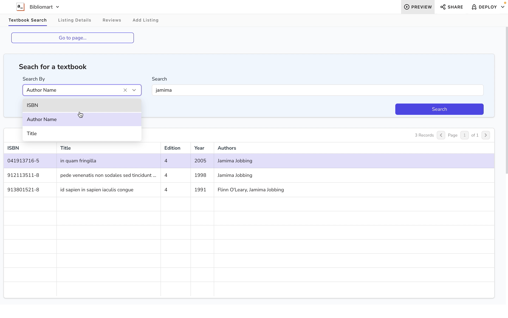
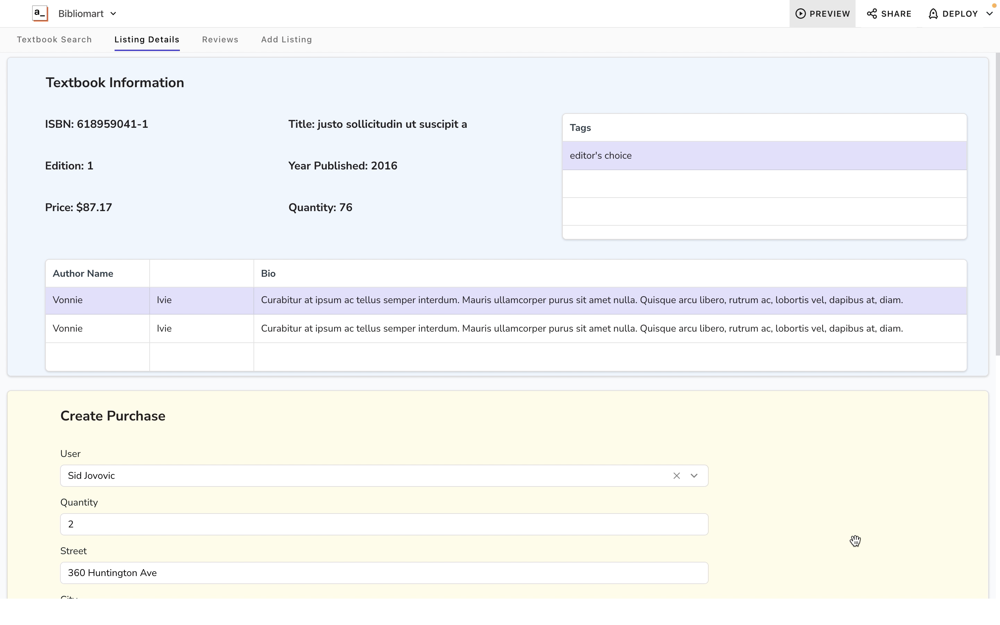
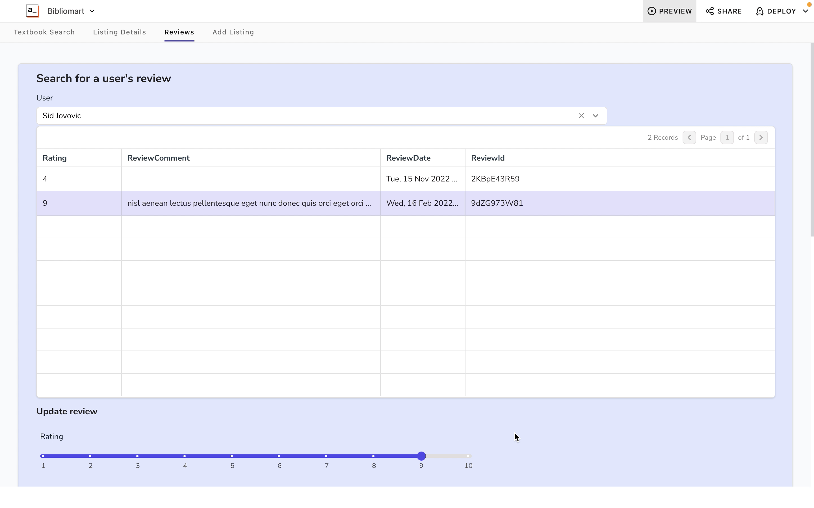
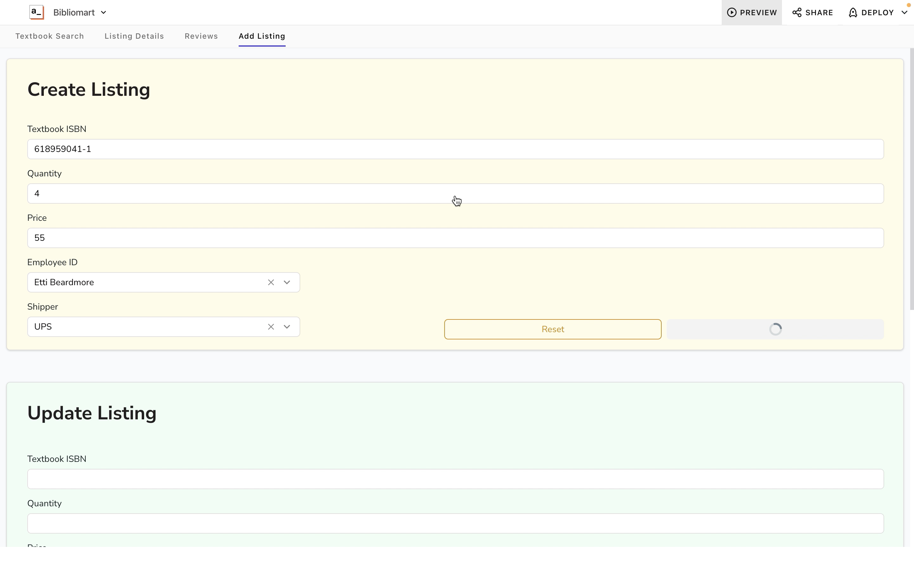

# BiblioMart

BiblioMart is a full-stack application for buying and selling textbooks. It allows buyers to search for and purchase textbooks, and site administrators to manage textbook listings and reviews about users. The backend consists of a number of RESTful API endpoints implemented using Python and Flask, a popular web framework. These endpoints connect to a database using MySQL, a relational database management system. The front end is a web app implemented with Appsmith, a drag-and-drop UI editor.

This app was created to explore how a relational database could be integrated into an application. We’ve created four web pages that represent the core functionality of the product. Pages accessing the other parts of our database have not yet been created.

## Screenshots

The textbooks search page allowing users to search for textbooks using a number of options

The listing details page allowing users to see detailed information about a textbook listing and make a purchase

The user reviews page allowing site administrators to view, edit, and add reviews about customers

The listing management page allowing site administrators to add, edit, and delete listings for textbooks

# Installation

To run BiblioMart, follow these steps:

1. Clone this repository
2. Create a file named `db_root_password.txt` in the `secrets/` folder, and put inside of it the root password for MySQL.
3. Create a file named `db_password.txt` in the `secrets/` folder, and put inside of it the password you want to use for the a non-root user named webapp.
4. In a terminal or command prompt, navigate to the folder with the docker-compose.yml file.
5. Build the images with docker compose build
6. Start the containers with `docker compose up`. To run in detached mode, run docker `compose up -d`. This starts three containers: the MySQL database, The Python Flask application, and the front end Appsmith application
7. The application will now be running on your local machine at http://localhost:8080.

For development, Install Python 3 and Flask using pip, the Python package manager, by running `pip install flask`

# Testing

In the BiblioMart application, to ensure our routes are valid. Thunder Client was used to test them before implementation. All of the routes were tested by creating routes that were fully developed first. The testing was simple due to the routes including messages to indicate their success or failure. These tests allowed us to notice any errors in our routes and go back to correct them.

# Conclusion

BiblioMart is a simple application for buying and selling textbooks, implemented using Python, Flask, and MySQL. The application provides RESTful API endpoints for managing textbooks, listings, and reviews, and includes error handling and logging for enhanced reliability and troubleshooting. If you have any questions or need further assistance, please refer to the documentation or contact the application administrator.
